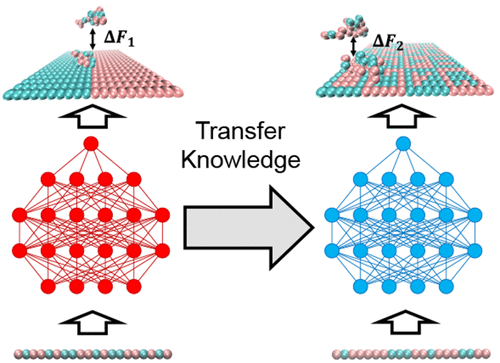

# [Transfer Learning Facilitates the Prediction of Polymer-Surface Adhesion Strength](https://pubs.acs.org/doi/10.1021/acs.jctc.2c01314)

This repository TL_PSI contains an open source implementation of the machine learning model and corresponding dataset described in our paper Transfer Learning Facilitates the Prediction of Polymer-Surface Adhesion Strength.



## Abstract
Machine learning (ML) accelerates the exploration of material properties and their links to the structure of the underlying molecules. In previous work [Shi et al. ACS Applied Materials & Interfaces 2022, 14, 37161−37169.](https://pubs.acs.org/doi/10.1021/acsami.2c08891), ML models were applied to predict the adhesive free energy of polymer–surface interactions with high accuracy from the knowledge of the sequence data, demonstrating successes in inverse-design of polymer sequence for known surface compositions. While the method was shown to be successful in designing polymers for a known surface, extensive data sets were needed for each specific surface in order to train the surrogate models. Ideally, one should be able to infer information about similar surfaces without having to regenerate a full complement of adhesion data for each new case. In the current work, we demonstrate a transfer learning (TL) technique using a deep neural network to improve the accuracy of ML models trained on small data sets by pretraining on a larger database from a related system and fine-tuning the weights of all layers with a small amount of additional data. The shared knowledge from the pretrained model facilitates the prediction accuracy significantly on small data sets. We also explore the limits of database size on accuracy and the optimal tuning of network architecture and parameters for our learning tasks. While applied to a relatively simple coarse-grained (CG) polymer model, the general lessons of this study apply to detailed modeling studies and the broader problems of inverse materials design.

## Cite this work and star this repo
If this repository and dataset is helpful for your research please cite this work and star this repo.

```
@article{shi2023transfer,
author = {Shi, Jiale and Albreiki, Fahed and Colón, Yamil J. and Srivastava, 
Samanvaya and Whitmer, Jonathan K.},
title = {Transfer Learning Facilitates the Prediction of Polymer–Surface Adhesion Strength},
journal = {Journal of Chemical Theory and Computation},
volume = {0},
number = {0},
pages = {null},
year = {2023},
doi = {10.1021/acs.jctc.2c01314},
URL = {https://doi.org/10.1021/acs.jctc.2c01314},
eprint = {https://doi.org/10.1021/acs.jctc.2c01314}
}

```
arxiv version link: https://arxiv.org/abs/2301.02219

## Note
code and data for academic purpose only.
